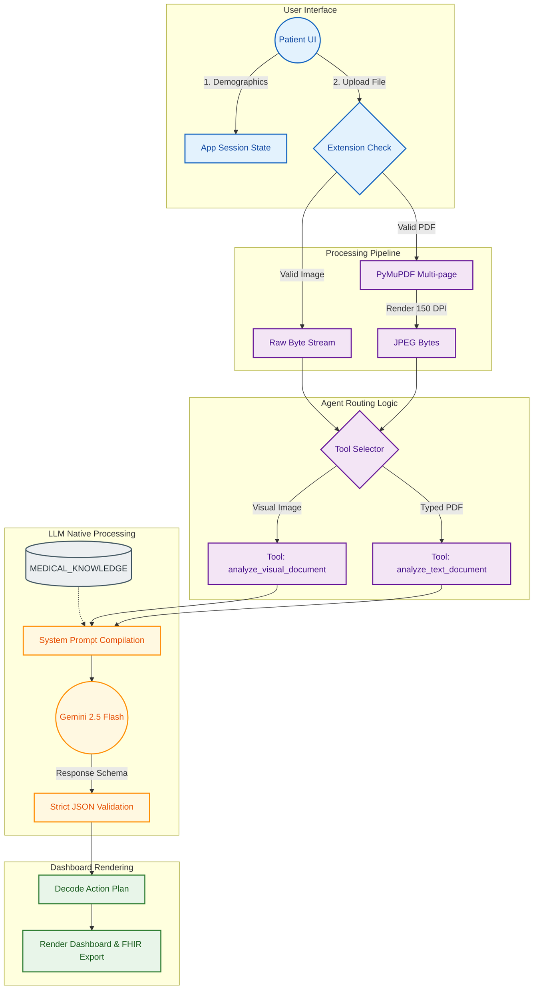

<div align="center">

# Patient Action Guide: A Multimodal AI System for Automated Medical Report Analysis

[](https://ieee.org/)
[](https://www.python.org/)
[](https://streamlit.io/)
[](https://opensource.org/licenses/MIT)

**Official implementation code and evaluation framework for the upcoming IEEE publication.**
</div>

---

## 📖 Abstract

The **Patient Action Guide** is an Explainable AI (XAI) application designed to democratize medical report comprehension and bridge the health-literacy gap. Leveraging Google's Gemini 2.5 Flash, the architecture ingests unstructured medical documents (PDFs) and low-resource optical imagery (scans, photos) to output layman-friendly, highly localized clinical action plans. 

Unlike generic medical LLMs, this system implements a **culturally calibrated engine** optimized for Indian demographics, offering native dietary heuristics, Ayurvedic interaction safety checks, predictive "Point-of-No-Return" forecasting, and privacy-aware preprocessing before cloud inference.

---

## 🔬 Methodology & Core Contributions

Our research introduces several key innovations to the Medical Vision-Language Model (VLM) pipeline:

### 1. Multimodal Clinical Extraction
* **Omni-Format Support:** Robust processing of unstructured text (PDFs) and low-quality optical imagery (JPG/PNG/Scans).
* **Intelligent Routing:** Dynamic routing algorithms directing text vs. visual inputs to specialized internal prompting mechanisms to maximize diagnostic extraction accuracy.

### 2. Culturally Calibrated Clinical Engine
* **Localized Dietetics:** Algorithmic generation of dietary plans mapping to specific regional food datasets (e.g., *Moong Dal*, *Ragi*) rather than generic Western nutrition.
* **Ayurvedic Warning System:** Cross-references detected clinical biomarkers against prevalent herbal remedies (e.g., *Giloy*, *Ashwagandha*) to explicitly flag contraindicated interactions.
* **Jargon Demystification:** Extracts the highest-complexity medical terminology and algorithmically simplifies it to a 5th-grade reading level.

### 3. Predictive & Preventative Health Forecasting
* **Irreversible Timeline (Point of No Return):** A novel metric forecasting the timeframe until a diagnosed condition becomes biologically permanent without immediate lifestyle intervention.
* **Cost Guard Prediction:** Actively suggests clinically equivalent, lower-cost baseline diagnostics to prevent unnecessary patient expenditure.

### 4. Explainable AI (XAI) & Privacy
* **Traceability Matrix:** Maps critical advice back to quotations or values from the uploaded report.
* **Text PII Redaction:** Microsoft Presidio (with regex fallback) for text inputs; image/PDF inputs rely on instruction-based redaction before Gemini inference.
* **HL7 FHIR R4 Interoperability:** Structured FHIR JSON `Observation` bundles when quantifiable lab results are detected.

---

## 🏗️ System Architecture

The following flowchart details the extraction, routing, and processing layers of the application.



---

## 📊 Evaluation Framework

Automated evaluation scripts measure faithfulness, readability, FHIR compliance, demographic fairness, and visual robustness. **Run evaluations locally to generate your own scores** — results depend on your API keys and dataset.

### Quick start (full suite)

```bash
# 1. Configure API keys
cp .env.example .env

# 2. Build evaluation dataset from PMC abstracts (no synthetic lab injection)
python download_pmc.py --count 50

# 3. Run everything (pipeline + ablation + bias + robustness)
python run_all_evaluations.py --count 10
```

### Individual scripts

| Script | Purpose |
|--------|---------|
| `evaluate_pipeline.py` | End-to-end: run agent → score → `evaluation_results.csv` + `evaluation_summary.json` |
| `evaluate_ablation.py` | B0–B4 ablation study → `ablation_results.json` |
| `evaluate_bias.py` | 8 demographic personas → `fairness_evaluation_results.json` |
| `evaluate_robustness.py` | Degraded image conditions → `robustness_evaluation_results.json` |
| `evaluate_hallucination.py` | LLM-as-judge on pre-filled advice pairs |
| `evaluate_comparison.py` | Temperature 0.0 vs 0.7 comparison |
| `clinician_review.py export` | Create `clinician_review_sheet.csv` for doctor ratings |
| `clinician_review.py import` | Merge clinician scores back into results |

### Offline smoke test (no API key)

```bash
python evaluate_pipeline.py --input evaluation_cases.csv --skip-agent
```
*(Requires pre-filled `ai_generated_advice` column, or use only after running the agent.)*

### Clinician validation workflow

```bash
python evaluate_pipeline.py --count 20
python clinician_review.py export
# Doctors fill clinician_grade_1_to_10, is_clinically_safe, clinician_feedback_notes
python clinician_review.py import
python clinician_review.py summarize
```

Literature comparison values (GPT-4, MIRAGE, etc.) are stored in `evaluation/literature_baselines.json` for **reference only** — they are not reproduced automatically.

---

## ⚙️ Installation & Usage

To run the full multimodal interface locally for clinical or research testing:

1. **Clone the repository:**
   ```bash
   git clone https://github.com/hemanth1139/Ai-medical-analayzer.git
   cd patient_action_guide
   ```

2. **Install dependencies:**
   ```bash
   pip install -r requirements.txt
   ```

3. **Configure the Environment:**
   Initialize your `.env` file and insert your API credentials:
   ```bash
   cp .env.example .env
   # Add: GEMINI_API_KEY=your_api_key_here
   ```

4. **Launch the Application:**
   ```bash
   streamlit run app.py
   ```

---

## 📝 Citation

If you utilize this architecture, codebase, or methodology in your academic research, please cite our upcoming paper:

**IEEE Format:**
> Hemanth Kumar D, Balaji R, and Dr. Beulah A, "Patient Action Guide: A Multimodal AI System for Automated Medical Report Analysis," *IEEE [Pending Publication]*, 2026.

**BibTeX (for LaTeX):**
```bibtex
@article{patientactionguide2026,
  title={Patient Action Guide: A Multimodal AI System 
         for Automated Medical Report Analysis},
  author={Hemanth Kumar D and Balaji R and Dr. Beulah A},
  journal={IEEE [Pending Publication]},
  year={2026}
}
```

## 📄 License
This source code is licensed under the MIT License - see the `LICENSE` file for details.
