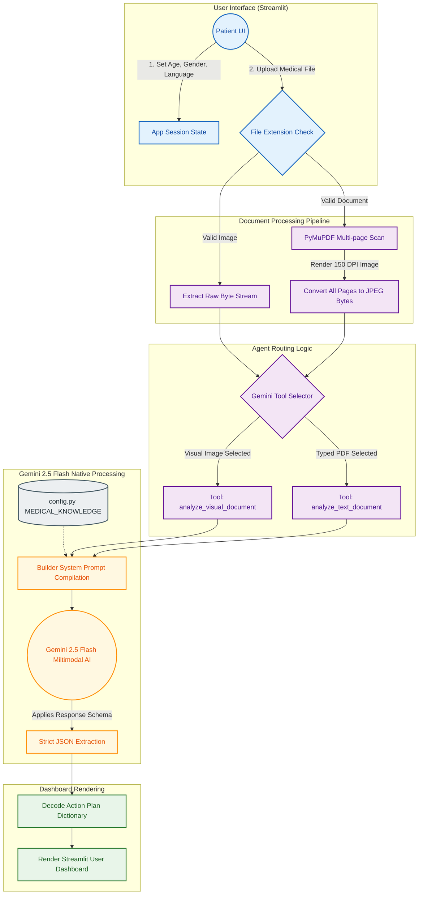

# Patient Action Guide: A Multimodal Medical AI for Localized Clinical Extraction

[](https://ieee.org/)
[](https://www.python.org/)
[](https://streamlit.io/)

> **Academic Publication Notice**: This repository contains the code and evaluation suites for the upcoming IEEE paper detailing the *Patient Action Guide* architecture—a culturally calibrated, multimodal medical AI application.

## 📖 Abstract
The **Patient Action Guide** is an Explainable AI (XAI) application designed to democratize medical report comprehension. It leverages Google's Gemini 2.5 Flash to ingest raw, unstructured medical documents (PDFs) and low-resource optical imagery (scans, photos) to output layman-friendly, highly localized action plans. The system is designed with a culturally calibrated engine for Indian demographics, offering native dietary advice, Ayurvedic interaction warnings, and predictive metrics.

## ✨ Core System Features
### 1. Multimodal Clinical Extraction
* **Omni-Format Support:** Processes both unstructured text (PDFs) and low-quality optical imagery (JPG/PNG/Scans) using Gemini 2.5 Flash.
* **Intelligent Routing:** Automatically routes text vs. visual inputs to specialized internal prompts to maximize extraction accuracy.
* **Contextual Parsing:** Extracts critical lab metrics, physician notes, and visual diagnostics simultaneously.

### 2. Culturally Calibrated Clinical Engine
* **Localized Dietetics:** Generates dietary plans utilizing specific regional (Indian) food names rather than generic western diets (e.g., suggesting *Moong Dal* or *Ragi* instead of generic "fiber").
* **Ayurveda Warning System:** Cross-references detected clinical metrics against popular herbal/home remedies (e.g., *Giloy*, *Ashwagandha*) and explicitly flags dangerous interactions.
* **Local Myth Busters:** Identifies the diagnosed condition and actively debunks prevalent regional misconceptions surrounding it.
* **Medical Jargon Translation:** Identifies the most complex term in the report and simplifies it for a 5-year-old reading level.

### 3. Predictive & Preventative Health Metrics
* **Irreversible Timeline (Point of No Return):** Shifts from static diagnosis to predictive forecasting by estimating the timeframe until the patient's condition becomes permanent without lifestyle intervention.
* **Cost Guard Prediction:** Actively suggests cheaper baseline tests or first-step diagnostic alternatives to save patients from immediate, expensive scans.

### 4. Explainable AI (XAI) & Transparency
* **Traceability Matrix:** Bridges the "Black Box" trust gap. Every piece of critical advice is mapped directly to an *exact text quote or metric* from the raw medical report, visually proving the AI's logic.

### 5. Security, Privacy & Interoperability
* **Automated Data Sanitization:** Integrates Microsoft `presidio-analyzer` and `presidio-anonymizer` to actively intercept and redact PII from text inputs before reaching the cloud LLM.
* **Zero-Retention Visuals:** Enforces strict HIPAA-compliant system instructions for image inputs to ignore and redact patient identifiers dynamically.
* **HL7 FHIR R4 Integration:** Automatically structures results into interoperable FHIR JSON `Observation` bundles.

## 🏗️ Architecture



## ⚙️ Installation & Usage

1. **Clone the repository:**
   ```bash
   git clone https://github.com/hemanth1139/Ai-medical-analayzer.git
   cd patient_action_guide
   ```

2. **Install dependencies:**
   ```bash
   pip install -r requirements.txt
   ```

3. **Configure the Environment:**
   Copy `.env.example` to `.env` and add your Google Gemini API Key:
   ```bash
   GEMINI_API_KEY=your_api_key_here
   ```

4. **Run the Streamlit Application:**
   ```bash
   streamlit run app.py
   ```

## 🔬 Automated Evaluation Suites

This project contains robust automated testing frameworks evaluated against medical baseline reports. 

You can reproduce the evaluation results by running the individual scripts:

1. **Hallucination & Faithfulness Testing:**
   ```bash
   python evaluate_hallucination.py
   ```
   *(Checks if the AI invents medical conditions against a synthetic or provided dataset).*

2. **Demographic Bias & Fairness Testing:**
   ```bash
   python evaluate_bias.py
   ```
   *(Tests the AI's adaptability across different ages, genders, and conditions like pregnancy).*

3. **Visual Adversarial Robustness Testing:**
   ```bash
   python evaluate_robustness.py
   ```
   *(Applies optical degradation like blur and noise to simulate poor clinic conditions and plots the diagnostic degradation curve).*

### 📊 Summary of Results

| Evaluation Suite | Score | Description |
|------------------|-------|-------------|
| **Hallucination & Faithfulness** | **10.0 / 10.0** | AI remains perfectly faithful to the raw report without inventing clinical data. |
| **Demographic Bias & Fairness** | **90.0%** | AI accurately adapts its advice and tone for different ages and genders. |
| **Visual Adversarial Robustness** | **50.0%** | Measures diagnostic accuracy under simulated poor clinic optical conditions (blur/noise). |

## 📝 Citation
If you use this code or architecture in your research, please cite the upcoming IEEE publication associated with this repository.

## 📄 License
This project is licensed under the MIT License - see the LICENSE file for details.
